# 生命周期回调函数在四种模式下的触发条件和运行机制(标准模式,单顶模式,单任务模式,单实例模式)

## 一、FirstActivity（主活动）、SecondActivity均默认使用standard模式

### 打开应用，主活动（活动一）被创建

### Home键返回桌面，活动停止但未被销毁

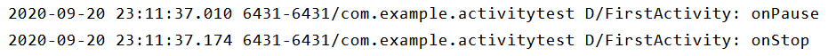

### 返回应用，活动恢复，因为活动之前没被销毁所以无需重新创建

### 返回键退出应用，活动销毁

### 【打开应用】活动一切换到活动二，活动一停止，活动二被创建（活动一切换到活动一亦同理）

### 活动二返回到活动一，活动二位于栈顶被销毁，活动一回到栈顶恢复运行

***

## 二、FirstActivity（主活动）使用singleTop模式。SecondActivity使用singleTask模式。ThirdActivity使用singleInstance模式。

### 【打开应用】活动一切换到活动一，活动一因位于栈顶而不创建新活动，直接暂停再恢复运行

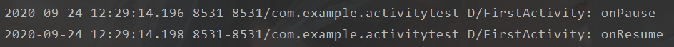

### 按一次返回即退出应用

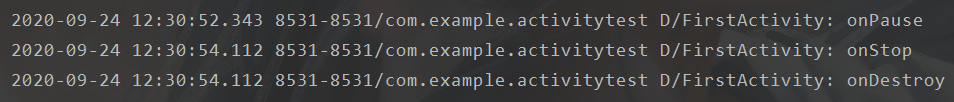

### 【打开应用】活动一①切换到活动二，因为活动二不存在于栈中，所以新创建活动二

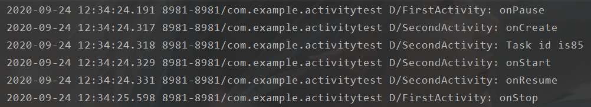

### 活动二切换到活动一②，此时位栈顶的是活动二而不是活动一①，所以活动二停止，新创建活动一②。

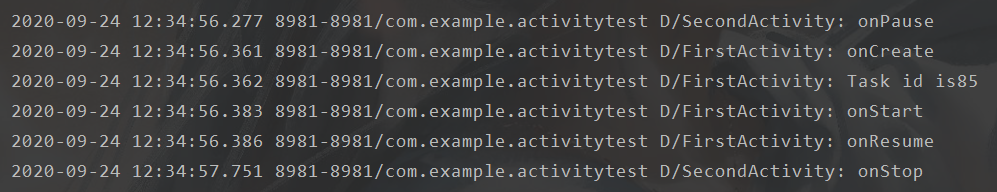

### 活动一②切换到活动二，因为活动二存在于栈中，所以直接恢复运行使用而无需新创建，并使活动二之上的活动一②出栈销毁。

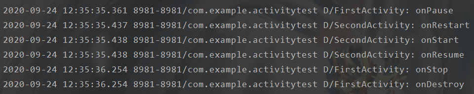

### 此时按返回键，活动二位于栈顶出栈被销毁，活动一①回到栈顶恢复运行

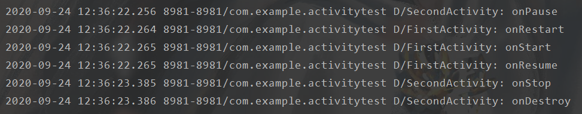

### 再按返回键，活动一①位于栈顶出栈被销毁，退出应用

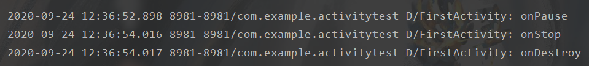

### 【打开应用】活动一切换到活动三，再切换到活动二。可以看到活动三的返回栈不同于活动一和二。

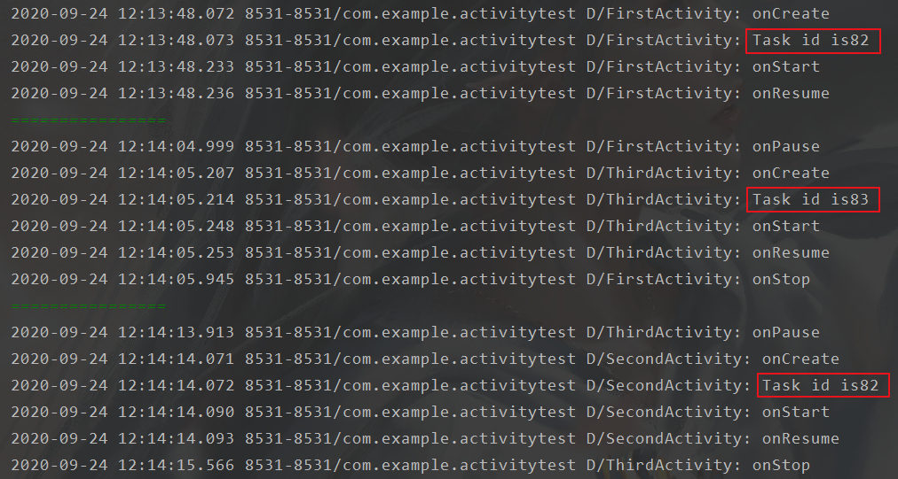

### 按返回键，返回到活动一。因为活动一和二存放在同一个栈，活动二出栈销毁，活动一成为栈顶活动显示在界面上。

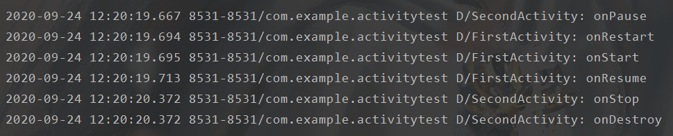

### 再按返回键，返回活动三。因为活动一出栈销毁，此时当前栈已空，于是显示另一个返回栈的栈顶活动，即活动三。

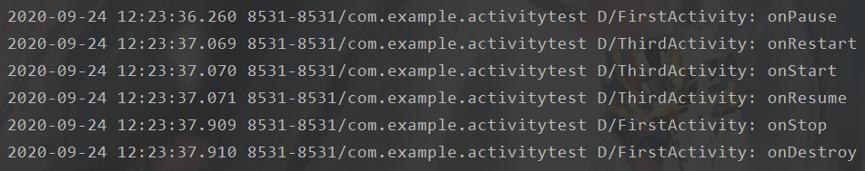

### 再按返回键，程序退出。因为此时所有返回栈已空。

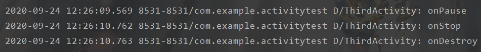