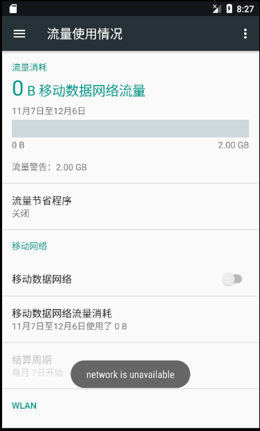
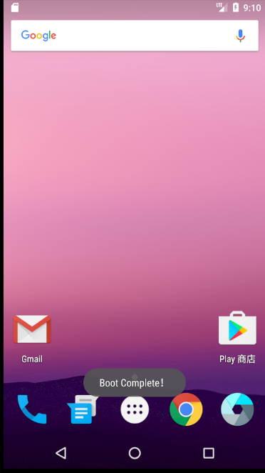

# 广播，自定义广播的使用。

## 动态注册广播接收器：新建一个类，继承BroadcastReceiver，并重写onReceive方法，当接收到广播时方法执行。

注意问题：

必须配置相应的权限声明，否则程序将直接崩溃。

### 接收系统广播，动态注册监听网络变化

打开和关闭数据网络时可以看到相应的提示，证明创建的广播接收器成功接收到系统发来的广播。

## 静态注册广播接收器：在AndroidManifest.xml中注册

开机时可以出现相应的提示信息，证明创建的广播接收器成功接收到系统发来的广播。