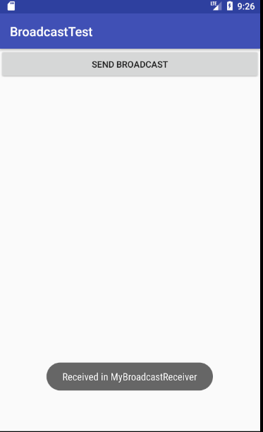
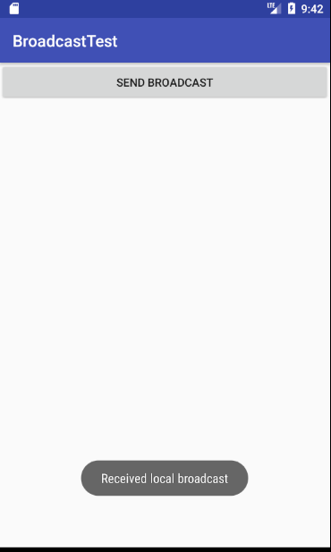
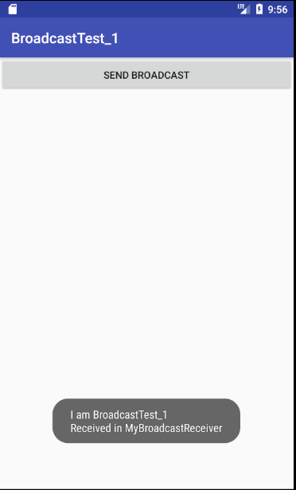

# 广播，自定义广播的使用。

## 动态注册广播接收器：新建一个类，继承BroadcastReceiver，并重写onReceive方法，当接收到广播时方法执行。

注意问题：

必须配置相应的权限声明，否则程序将直接崩溃。

### 接收系统广播，动态注册监听网络变化

打开和关闭数据网络时可以看到相应的提示，证明创建的广播接收器成功接收到系统发来的广播。

## 静态注册广播接收器：在AndroidManifest.xml中注册

开机时可以出现相应的提示信息，证明创建的广播接收器成功接收到系统发来的广播。

## 发送自定义广播

### 点击按钮发送标准广播

可以看到相应的提示信息，证明发送的自定义标准广播成功被接收。

### 按钮新增发送本地广播，即点击按钮发送全局广播和本地广播。

#### 本程序接收到了两种广播，分别是全局广播和本地广播。

另一个程序BroadcastTest_1（程序已经实现接收这两个广播的功能）只接收到一条广播（全局广播），另一条本地广播未成功接收到。

由此验证了本地广播只会在自身程序内传播。