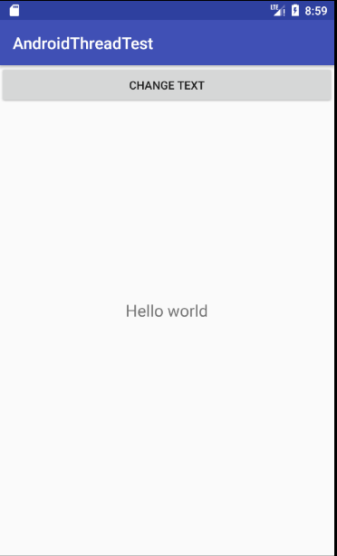
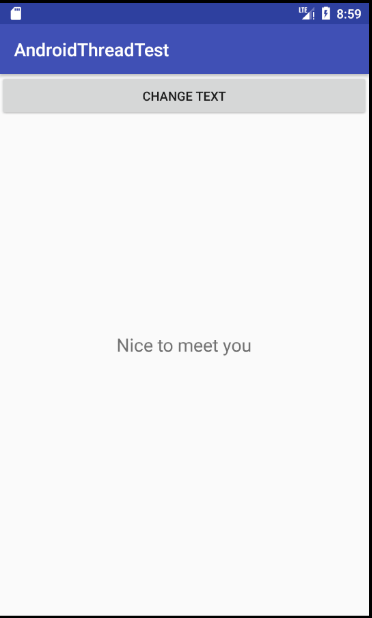

# 创建子线程的程序框架，消息处理机制和多线程之间的数据交换。

安卓不允许在子线程中进行UI操作，为此提供了一套异步消息处理机制

程序界面

点击按钮，更改显示内容。

原理：

Android中的异步消息处理机制主要由四个部分组成：Message、Handler、MessageQueue、Looper。

首先在主线程中创建Handler对象，重写handlerMessage()方法。当子线程中需要进行UI操作时，创建Message对象，通过Handler将消息发送出去，此消息被添加到MessageQueue对列中等待被Looper取出发回到主线程的handlerMessage()方法进行处理（UI操作），从而实现多线程之间的数据交换。