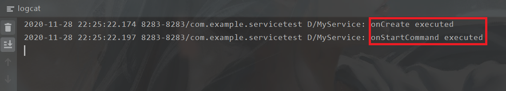
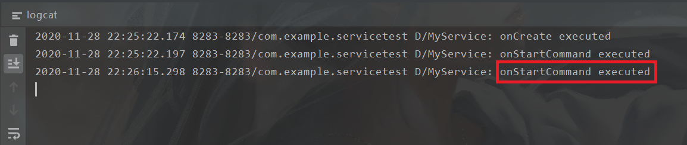
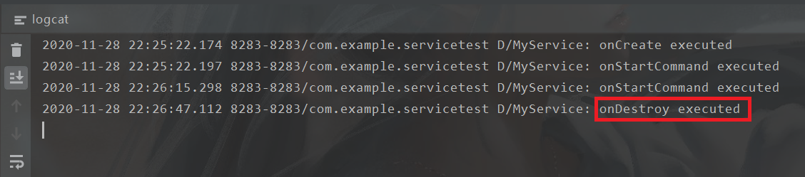

# 服务：启动和停止服务，服务代码运行在显示子线程。(注意：一定要熟练到，哪部分代码在哪个时间片运行，哪个变量是独立的，哪个变量是共享的，多个线程之间如何通讯。)

界面

点击开启服务，调用onCreate()和onStartCommand()方法

再次点击开启服务，只调用onStartCommand()方法

点击停止服务，调用onDestroy()方法

### 使用IntentService实现多线程

点击子线程服务按钮

